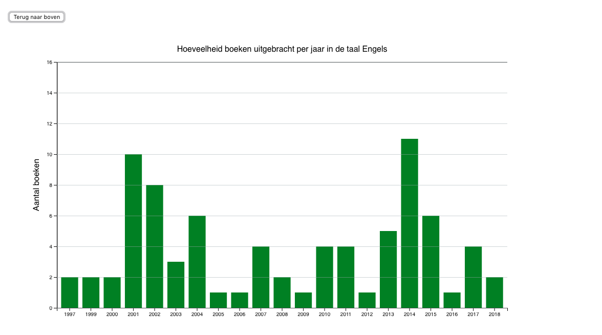

# frontend-data

I left the spaghetti I created last week behind me and started afresh on this new project.

This time I decided to use the oba wrapper made by wouter (maanlamp) which significantly improved my life (and my application).

I implemented the following commands:

`npm run build`

Runs browserify to make my application usable in a browser environment

`npm run data`

Makes a get request to retrieve new data and add it to the d3 environment

`npm start`

Runs both of the above commands, first retrieving data then building the app so it can be displayed in the browser

## What does my application do?

Make a get request to the oba api, and uses the data received to draw a bar chart displaying the absolute values, along with a pie chart that shows the percentual values.

The bar chart visualizes the amount of books per language for a certain time period. The pie chart visualizes the distribution between those languages.

This gives the user an insight on the change over time both in the amount of books and the distribution between languages.

## What's the story

My request retrieves all books found by the query 'website'. By selecting a time period (1990-2000, 2000-2010, 2010-now) the user (you) is able to see a shift in both the amount of books written about websites as well as the changing distribution in the languages those books were written in.

When clicking on one of the languages it is also possible to see the distribution of this language across the years in a separate chart. This gives a more precise insight in the distribution over time.

## Data usage

This application uses only the 'year' and 'language' attributes of all books that match the query. Books with no year are filtered out, and books with no language get the 'language unkown' tag.

For the pie chart only language is used to determine a percentage. The main bar chart uses both year and language to display a certain time period. The bar chart per language uses the number of times that language occurs per year.

## Interaction

The user is able to select a time period from a dropdown menu, and can see the values of each bar or piece of pie by hovering over them. The colors of the barchart and the pie chart correspond.

When selecting a language by clicking on the bar or pie chart, the view of the window scrolls down and reveals a new bar chart. This bar chart displays in which years this language was most prevalent.

The user is brought back to the main view by clicking the back to top button.

[Try it out yourself here!](https://joostflick.github.io/frontend-data/)
